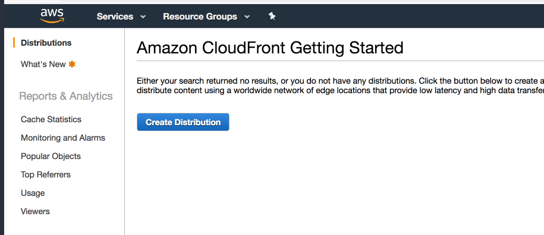
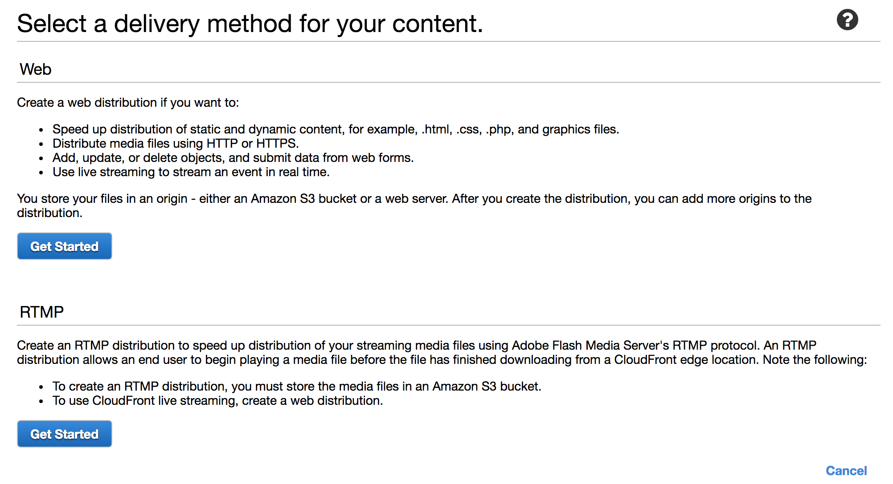
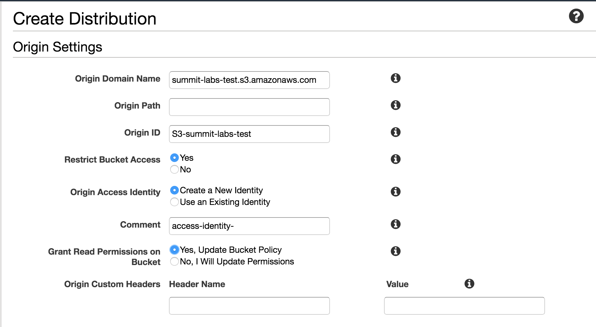
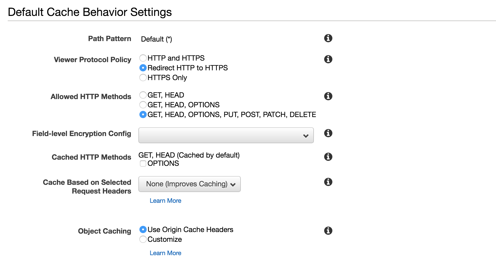
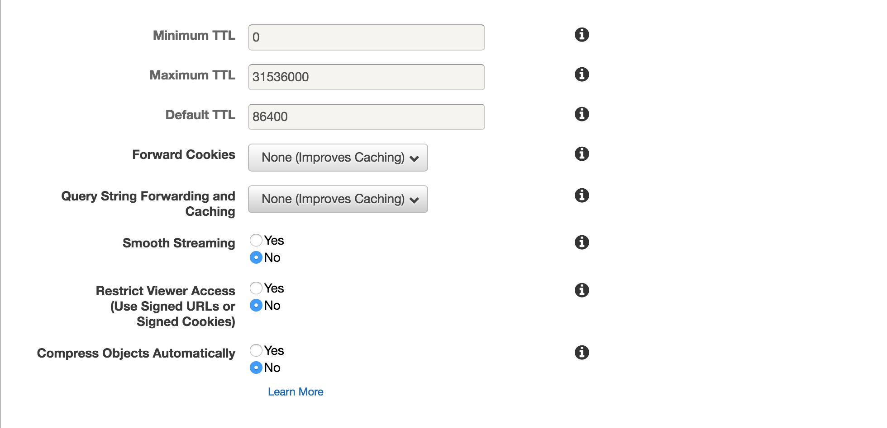
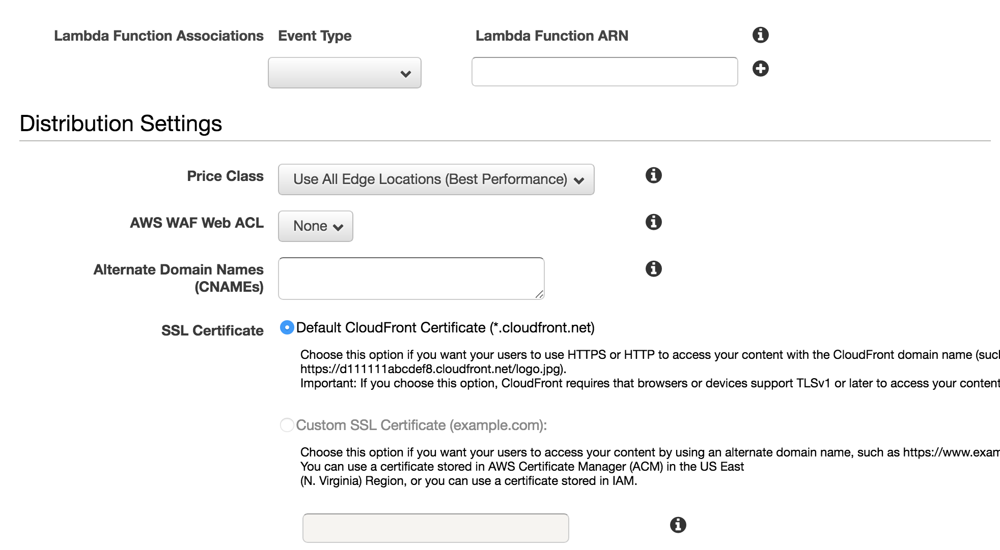
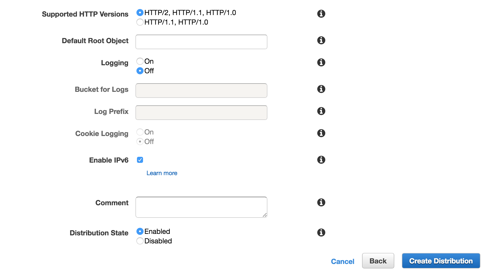
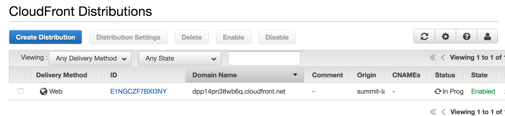

### CloudFront  
Can be used to deliver your entire website, including dynamic, static, streaming, and interactive content using a global network of edge locaitons. Requests for your content are automatically routed to the nearest edge location, so content is delivered with the best possible performance.

Amazon CloudFront is optimized to work with other AWS, like S3, EC2, ELB, and Route53. Also works seamlessly with any non-AWS origin server, which stores the original, definitive versions of your files.

Terminology
---

**_Edge Location_**  
This is the location where content will be cached. This is seperate to an AWS Region/AZ. Edge locatations are not just READ only, you can write to them also. (ie. put an object onto them)
  - Objects are cached for teh life of the Time to Live (TTL)
  - Objects can be cleared, but you will be charged

**_Origin_**  
This is the origin of all the files that the CDN will distribute. This can be: S3 Bucket, EC2 Instance, Elastic Load Balancer, or Route53. Origin server does not have to be AWS, can be a custom server.

**_Distribution_**  
The name given to the CDN which consists of a collection of Edge Locations. Can consist of multiple origins. (S3 buckets, etc.)
  - Access can be restricted to distribution using _Signed URLs_ or _Signed Cookies_
  - Custom behaviors can be configured using RegEx, e.g. Server all *.pdf files from a specific origin
  - Configuration of custom Error Pages
  - Restrict content based on geography
    - Can create a _Whitelist_ OR _BlackList_

  - **_Web Distribution_**  
  Typically used for websites

  - **_RTMP_**  
  Used for media streaming.

  #### Creating a CloudFront Distribution

  From the **_CloudFront Console_** select _Create Distribution_
  

  Select _Get Started_ under the **_Web_** section
  

  Complete the **_Create Distribution Form_**
 
  |Field Name|Description|Sample Value|
  |:---|:---|:---|
  |Origin Domain Name||mys3bucket.s3.amazonaws.com|
  |Origin Path||\<folder within mys3bucket\>|
  |Origin ID|Unique ID for user to help identify||
  |Restrict Bucket Access|If selected will no longer allow direct access to S3 bucket via URL, all requests will go through CloudFront||
  
  
  

  Selecting _Restrict Viewer Access_ allows for restricted Access to objects, ie. only users within my company can access this content

  
  

Select _Create Distribution_

Can take 5+ minutes to create distribution. Once complete the _Domain Name_ is accessible.

