### CloudWatch

Create a new CW dashboard
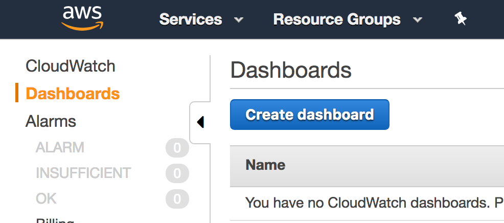

Add a Text Widget to give title, sub-title, layout, etc
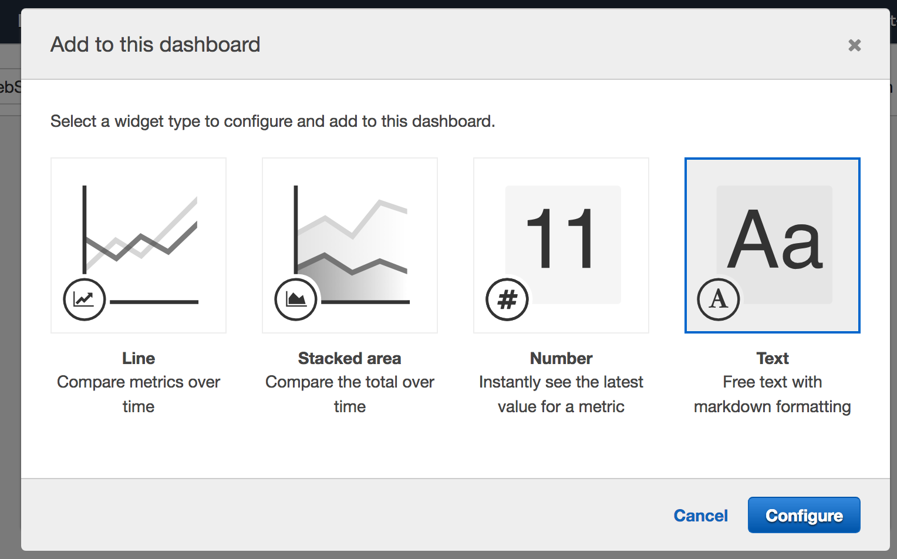

Add Line Chart
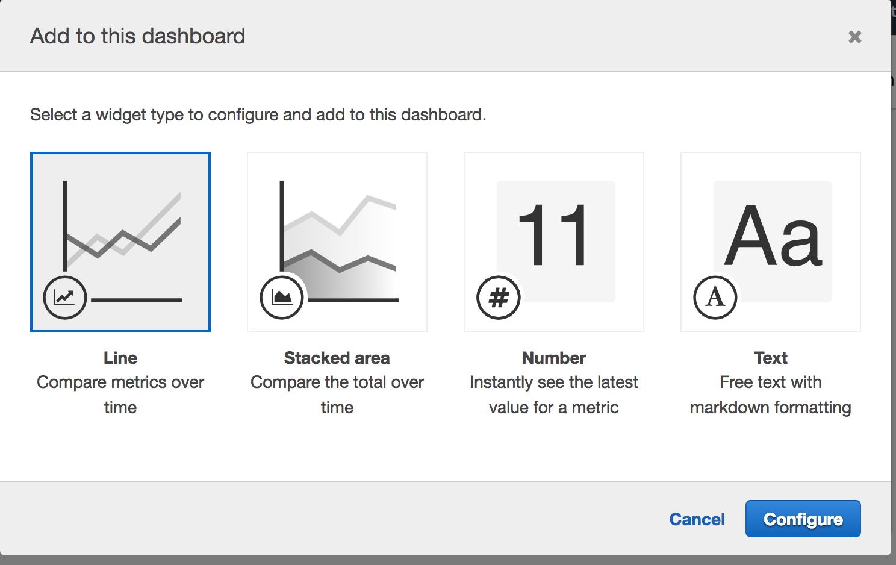

Select Resource to monitor
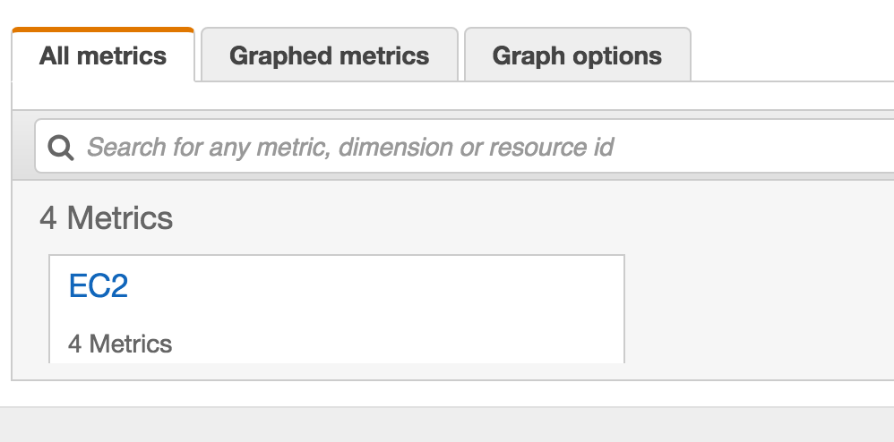

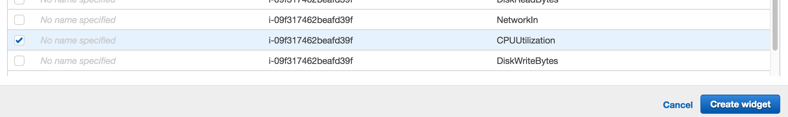

Metrics available by default are related to these areas:
- CPU 
- Disk
- Network
- Status

### Create Alarm
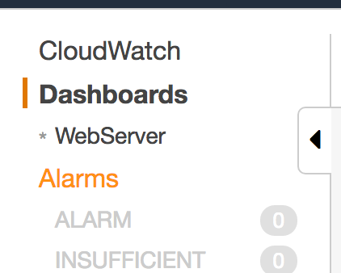
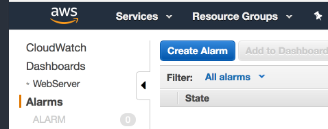

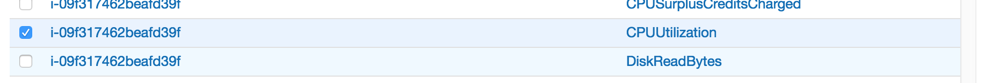
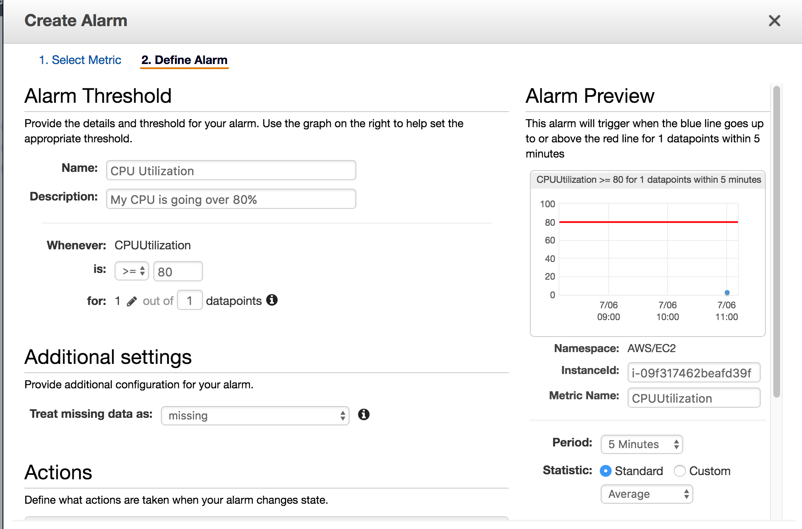

### Events
CloudWatch events help you to respond to state changes in resources. When resources chance state they automatically send events into an event stream. We can create rules that match events in the stream and route to targets for further execution.

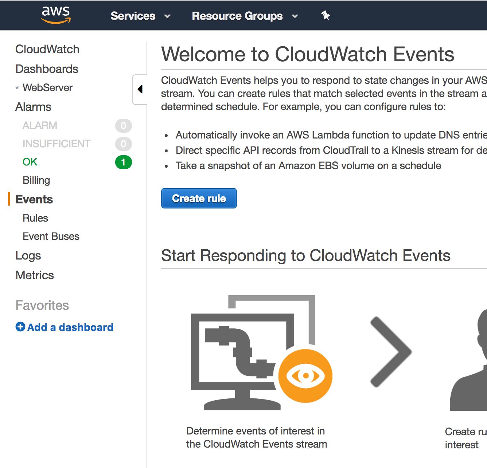

### Logs
Helps to aggregate, monitor, and store logs.

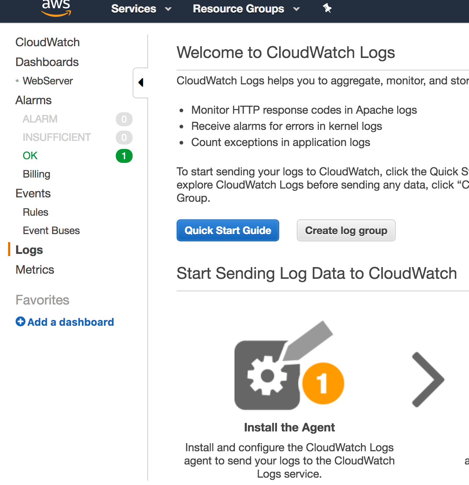

- Standard Monitoring = 5 minutes
- Detailed Monitoring = 1 minute

What can I do with Cloudwatch?
- Dashboards
  - Create dashboards to see what is happening with your AWS environment
- Alarms
  - If thresholds are hit
- Events
  - Help to respond to state changes in resources
- Logs
  - Helps to aggregate, monitor, and store logs

Vs. Cloudtrail
- Cloudtrail is used for auditing
  - I.E. creating a new resource, adding a new user
- Cloudwatch is for logging
  - Resource utilization