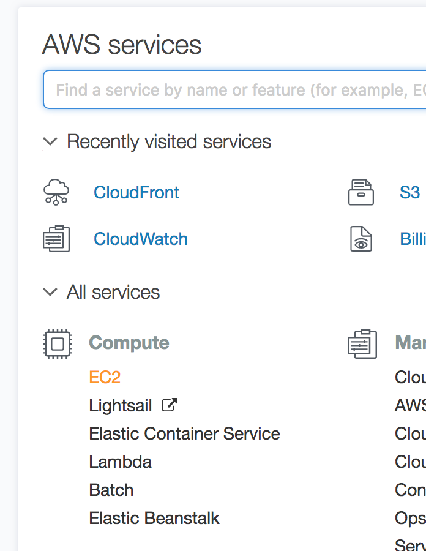
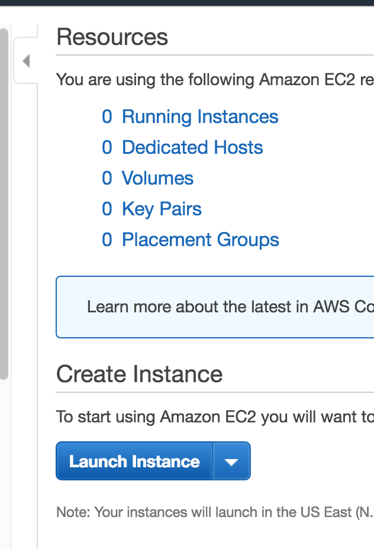
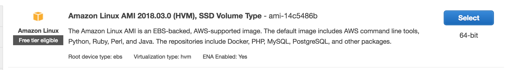
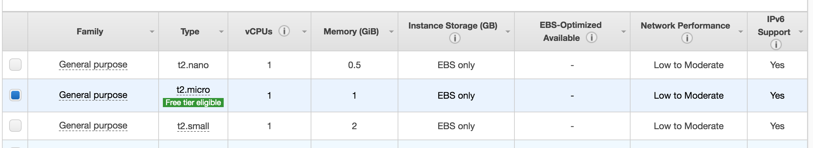
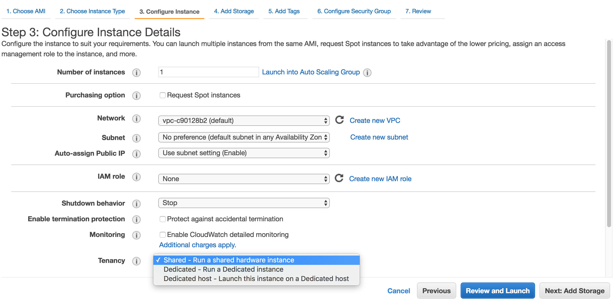

### EC2 (Elastic Compute Cloud)
A web service that provides resizable compute capacity in the cloud. Amazon EC2 reduces the time required to obtain and boot new server instances to minutes, allowing you to quickly scale capacity, both up and down, as your computing requirements change. 

Changes the econmics of computing by allowing you to pay only for capacity that you actually use. Amazon EC2 provides developers the tools to build failure resilient applications and isolate themselves from common failure scenarios.

#### Options
- On Demand: allows you to pay a fixed rate by the hour (or by the second) with no commitment.
  - For users that want the low cost and flexibility of Amazon EC2 without any up-front payment or long-term commitment
    - Paid by the second or by the hour
  - Applications with short term, spiky, or unpredictable workloads that cannot be interrupted
  - Applications being developed or tested on Amazon EC2 for the first time

- Reserved: provides you with a capacity reservation, and offer a significant discount on the hourly charge for an instance. 1 or 3 year terms.
  - Applications with steady state or predictable usage
  - Applications that require reserved capacity
  - Users can make up-front payments to reduce their total computing costs even further.
    - Standard RIs (up to 75% off on-demand)
    - Convertible RIs (up to 54% off on-demand) feature the capability to change the attributes of the RI as long as teh exchange results in the creation of RIs of equal or greater value.
    - Scheduled RIs are available to alunch withing the time window you reserve. This allows you to match your capacity reservation to a predictable recurring schedule that only requires a fraction of a day, wee, or month.
- Spot: enables you to bid whatever price you want for instance capacity, providing for even greater savings if you applications have fixed start and stop times.
  - Applications that have flexible start and end times
  - Applications that are only feasible at very low compute prices
  - Users with an urgent need for large amoutns of additional computing capacity
  - If a spot instance is terminated by Amazon EC2, you will not be charged for a partial hour of usage. However, if you terminate the instance, you will be charged for the complete hour which the instance ran.
    - If spot price goes over bid price, instances will terminate automatically.
- Dedicated Hosts: Physical EC2 server dedicated for your use. Dedicated hosts can help you reduce costs by allowing you to use your existing server-bound software licenses.
  - Useful for regulatory requirements that may not support multi-tenant virtualization
  - Great of licensing which does not support multi-tenancy or cloud deployments.
  - Can be purchased on-demand (hourly)
  - Can be purchased as a Reservation for up to 70% off the on-demand price.

#### Instance Types
|Family|Speciality|Use case|
|:---|:---|:---|
|F1|Field Programmable Gate Array|Genomics research, financial analytics, real-time video processing, big-data, etc|
|I3|High Speed Storage|NoSQL DBs, Data Warehousing, etc.|
|G3|Graphics Intensive|Video Encoding/ 3D Application Streaming|
|H1|High Disk Throughput|MapReduce-based workloads, distributed file systems such as HDFS and MapR-FS|
|T2|Lowest Cost, General Purpose|Web Servers, Small DBs|
|D2|Dense Storage|Fileservers/ Data Warehousing/ Hadoop|
|R4|Memory Optimized|Memory Intensive Apps/ DBs|
|M5|General Purpose|Application Servers|
|C5|Compute Optimized|CPU Intensive Apps/DBs|
|P3|Graphics/General Purpose GPU|Machine Learning, Bitcoin Mining, etc|
|X1|Memory Optimized|SAP HANA/Apache Spark, etc.|

_Remember Fight Club - **FIGHT DR. MCPX**_
- **F** - FPGA
- **I** - IOPS
- **G** - Graphics
- **H** - High Disk Throughput
- **T** - Cheap general purpose (think T2 Micro)
- **D** - Density
- **R** - Ram
- **M** - main chioce for general purpose apps
- **C** - Compute
- **P** - Graphics (think pics)
- **X** - Extreme memory

#### Elastic Block Storage (EBS)
Allows you to create storage volumes and attach them to EC2 instances. Once attached, you can create a file system on top of these volumes, run a database, or use them in any other way you would use a block device. EBS volumes are placed in specific Availability Zone, where they are automatically replicated to protect your from the failure of a single component.

** **By Default a volume will be deleted on termination.**  
** **By default _Termination Protection_ is turned off by default, you must turn it on.**  
** **EBS Root Volumes of your DEFAULT AMI's cannot be encrypted. You can also use a third party tool (i.e. bit locker - Windows) to encrypt the root volume, or by creating a custom AMI**  
** **Additional Volumes can be encrypted**
** Cannot mount 1 EBS volume to multiple EC2 instaces; instead use EFS or S3 (through role)

- General Purpose SSD (GP2)
  - General purpose, balances both price and performance
  - Ratio for 3 IOPS per GB with up to 10,000 IOPS and the ability to burst up to 3000 IOPS for extended periods of time for volumes at 3334 GB or greater.
- Provisioned IOPS SSD (IO1)
  - Designed for I/O intensive applications such as large relational or NoSQL databases.
  - Use if you need more than 10,000 IOPS
  - Can provision up to 20,000 IOPS per volume
- Throughput Optimized HHD (ST1)
  - Big Data
  - Data warehouses
  - Log Processing
  - **Cannot be a boot volume**
- Cold HDD
  - Lowest cost storage for infrequently accessed workloads
  - File Server
  - **Cannot be a boot volume**
- Magnetic (Standard)
  - Lowest cost per GB of all EBS volume types that **is** bootable. Magentic volumes are idela for workloads where data is accessed infrequently, and applications where the lowest storage cost is important.

#### Creating an EC2

- Termination protection is turned off by default, you must turn on.
- On EBS-backed instances, the defauly action is for the root EBS volume to be deleted with the instance is terminated.
- EBS-backed Root volumes can now be encrypted using AWS API or console, or you can use a third party tool (such as bit locker, etc) to encrypt the root volume

##### Subnets
Subnets are related to an AZ, subnets cannot cross AZs 

#### Security Groups
- Simply a virtual firewall
- Changes to Security Groups will be applied immediatley
- **Stateful**
  - When Inbound rules are added, Outbound traffic is allowed out automatically
- All Inbound Traffic is blocked by default
- Any number of EC2 instances w/in an SG
- Multiple SG attached to EC2 instances
- Cannot block specific IP Addresses using Security Groups, instead use _Network Access Control Lists_
- Can specify allow rules, but not deny rules

#### Status Checks
- System Status Checks: Verifies that an instance is reachable, tests if AWS is able to get network packets to instance. Is the Hypervisor up and operational?
- Instance Status Checks: Verifies instance OS is accepting traffic.

#### Monitoring
- Basic (included) occurs every 5 minutes
- Advanced (additional cost) occurs more frequently, ~1 min

Ensure Apache (HTTPD) always starts on reboot `chkconfig httpd on`

#### EBS Volumes
- EC2 and EBS **must be in the same** Availability Zone
- Changing the EBS volume size or type will not cause downtime, not available for Magnetic volumes
- Creating another EC2 or EBS in another AZ requires taking a snapshot of the volume first
  - Create Image or Volume from snapshot
    - Allows the change of Volume type or AZ
- Moving EBS to another AZ or region
  - Create Snapshot/image
  - Copy snapshot to new Region or AZ
  - Create image from snapshot
  - Boot from new image
- Snapshots: typically used for backups
- Images: typically used for creating new EC2 instances
- Volumes exist on EBS:
  - Virtual Hard Disk
  - Root device volume: where OS is installed
- Snapshots exist on S3
  - Not available for viewing through S3 however
- Snapshots are point in time copies of Volumes
- Snapshots are incremental -- only the blocks that have changed since last snapshot are moved to S3
- Inital snapshots will take some time to create
- Creating a snapshot for Amason EBS volumes that serve as root devices, you should stop the instance before taking the snapshot
  - _Snapshots can be taking on running image_
- Can create AMI's from EBS-backed instances and Snapshots
- Snapshots of encrypted volumes are encrypted automatically
- Volumes restored from encrypted snapshots are encrypted automatically
- Can share snapshots, only if they are unencrypted
  - With other accounts or made public

#### RAID
Redundant Array of Independent Disks
- RAID 0 - Striped, No Redundancy, Good Performance
- RAID 1 - Mirrored, Redundancy
- RAID 5 - Good for reads, bad for writes, AWS does not revommend ever putting RAID 5's on EBS
- RAID 10 - Striped & Mirrored, Good Redundancy, Good Performance
- Increased performance (IO) can be achieved by implementing a RAID Array on EC2 across multiple EBS volumes
- Taking a snapshot:
  - Problem - Snapshot excludes data held in the cache by applications and OS. This is typically ok for single volumes, but for mulitple voluemes in a RAID array, this can cause problems related to interdependencies of the array.
  - Solution - Take an application consistent snapshot
  - Stop the application from writing to disk
  - Flush all caches to the disk

  - How? Options:
    - Freeze the file system
    - Unmount the RAID array
    - Shutting down associated EC2 instance (most common)
      - Take snapshot
      - Power back up
    - 

#### Amazon Machine Images (AMI)

- To create a snapshot for Amazon EBS volumes that serve as root devices, you should stop the instance before taking the snapshot.
- Snapshots of encrypted volumes are encrypted automatically
- Volumes restored from encrypted snapshots are encrypted automatically
- You can share snapshots, but only if they are unencrypted. Encryption keys are connected to your AWS account.
  - These snapshots can be shared with other AWS accounts or made public

EBS vs Instance Store
- All AMIs are categorized as either backed by Amazon EBS or backed by instance store
- Both can be rebooted, you will not lose data on a reboot.
- By default both root volumes will be deleted on termination. EBS volumes can be retained if selected during setup.
- EBS Volumes:
  - The root device for an instance launched from the AMI is Amazon EBS volume created from an Amazon EBS snapshot.
  - Can be stopped. You will not lose data if stopped.
- Instance Store Volumes: 
  - The root device for an instance launched from the AMI is an instance stroe volume created from a template stored in S3.
  - AKA Ephimeral Storage
  - Cannot be stopped. If the underlying host fails, you will lose your data

#### Autoscaling

First need a launch configuration

#### Placement Groups

- Clustered Placement Group
  - Grouping of instances within a **single AZ**
  - Recommended for applications that need low network latency, high network throughput, or both
  - Only certain instances can be launched in to a CPG
    - Compute Optimized, GPU, Memory Optimized
  - Oldest version of a placement group, unless explicit assume this is the PG being referred to
- Spread Placement Group
  - Group of instances placed on distinct underlying hardware
  - Recommended for applications that have a small number of critical instances that should be kept seperate from each other.
- PG names must be unique within AWS account
- Recommended to use homogenous instances within a PG, i.e. same instance size and family
- Can't merge placement groups
- Can't move an existing instance into a PG. can create an AMI from existing instance, then launch new instance from AMI into PG.

#### Instance Meta-data

- Used to get info about an instance (ex: public ip)
- `curl http://169.254.169.254/latest/meta-data`
- `curl http://169.254.169.254/latest/user-data`

#### DNS

- ELB's do not have pre-defined IPv4 addresses, you resolve them to a DNS name via alias records
- Alias Record vs. CNAME
  - Alias Record: Allow you to resolve a naked domain name, aka: zone apex record, to an ELB's DNS address
    - Amazon specific
    - won't be charged for the lookup
    - Always choose Alias over CNAME
  - CNAMES: Points to another domain
    - Will be charged for the lookup
- Routing Policies:
  - Simple
  - Weighted: Send a % to a different server, Ex: A-B Testing
  - Latency: Where will the user get the best performance
  - Failover: allows you to tie a resource to a healthcheck, failover to another region when the healthcheck fails
  - Geolocation: handles resolving where your users are
  - Route53 supports MX Records
  - Route53 supports apex zone records (Naked domain names)
  - Route 53 is named so because the DNS port is on Port 53 and Route53 is a DNS service
  - Route53 allows for 50 domain names by default, can be raised by Amazon