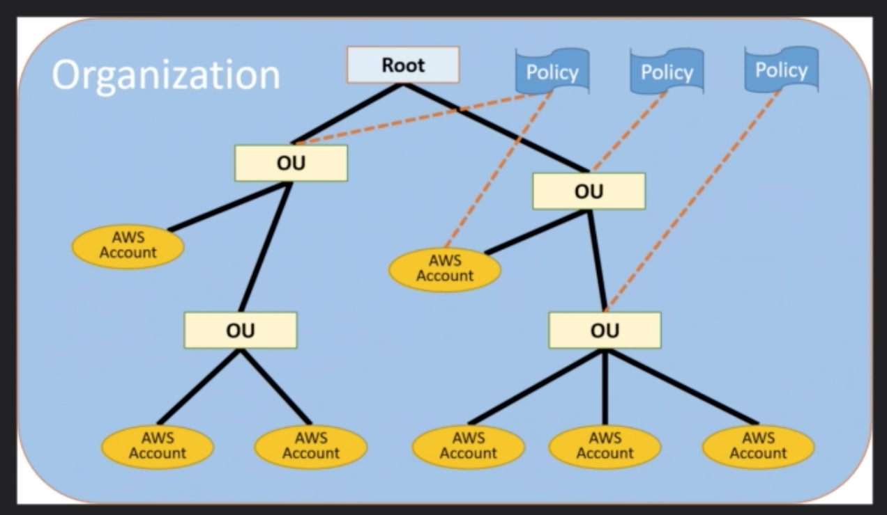
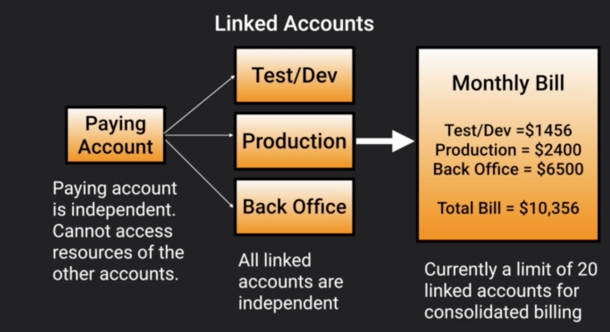
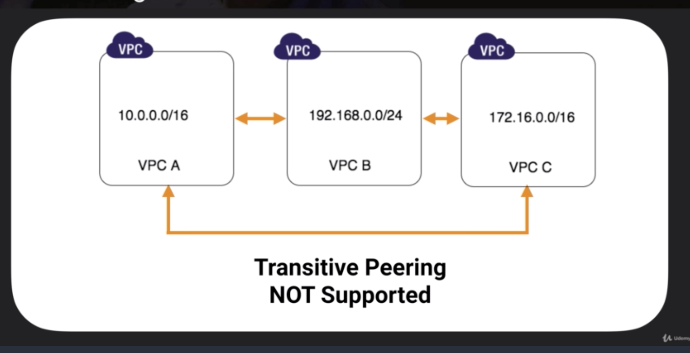
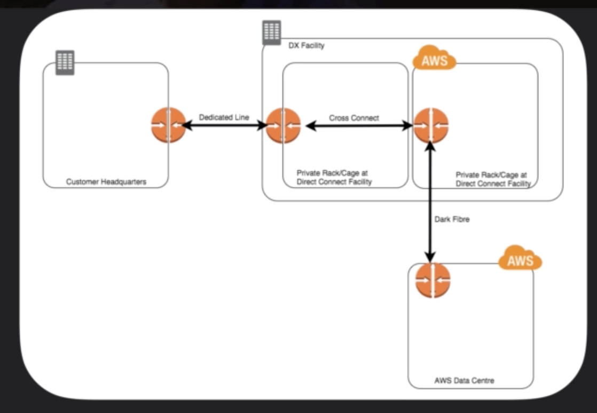
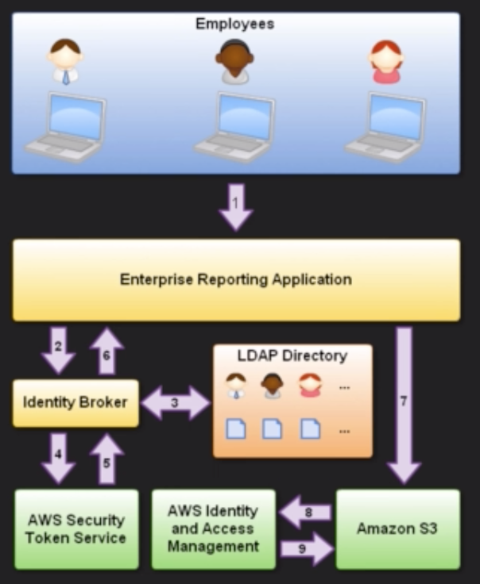
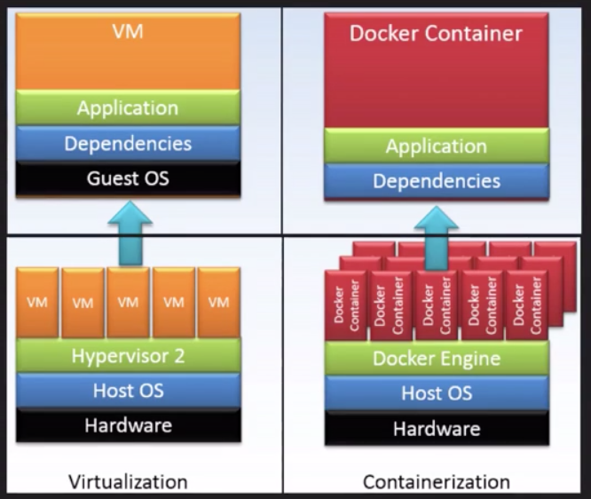

# Additional Exam Tips

## Kinesis

Amazon Kinesis is a fully managed service for real-time processing of streaming data at massive scale. You can configure hundreds of thousands of data producers to continuously put data into the Amazon Kinesis stream.

Ex: data from website clickstreams, application logs, and social media feeds. Within less than a second, the data will be available for Amazon Kinesis applications to read and process from the stream

(_italicized_ terms to watch for)
- Used to _consume_ big data
- Stream large amounts of social media, news feeds, logs, etc into the cloud

Other big data solutions:
  - Redshift for _Business Intelligence_
  - Elastic Map Reduce for _big data processing_

## EC2 - EBS Backed vs Instance Store

Volume = Hard Disk

|EBS Volumes|Instance Store Volumes|
|:---|:---|
|Persistent|Not Persistent (Ephemeral)|
|Can be detached and reattached to other instances|Can _not_ be detached and reattached to other instances, exist for the life of the instance|
|Can be stopped, data will persist|Can _not_ be stopped, data will be lost|
|Long term data storage|Short-term data storage|

## OpsWorks

- Orchestration Service that uses Chef
- Chef consists of recipes to maintain consistent state
- Key terms: _chef_, _recipes_, or _cook books_

## Elastic Transcoder

- Media Transcoder
- Converts media files from their original source format in to different formats that will play on smartphones, tablets, PC's, etc.
- Provides Transcoding presets for popular formats, prevents guessing on which presets work best for give devices
- Pay based on minutes and resolution transcoded
- Key terms: _mobile transcoding_, _video transcoding_ _video_

## Simple Workflow

### SWF Actors

- Workflow Starters - An application that can initiate (start) a workflow. 
  - EX: E-Commerce website placing an order or mobile app searching for bus times
- Deciders - Control the flow of the activity tasks in a workflow execution. If something has finished in a workflow (or fails) a _Decider_ decides what to do next
- Activity Workers - Do the tasks

## EC2
### Get Public IP Address

Query the instance metadata:
- `curl http://169.254.169.254/latest/meta-data/`
- `wget http://169.254.169.254/latest/meta-data/`
- This is the instances _metadata_ not user data

## Consolidated Billing

AWS Organizations is an account management service that enables consolidation of AWS accounts into an organization that you create and centrally manage

Benefits:
- Volume discounts on all accounts
- Unused reserved instances for EC2 are applied across the group
- CloudTrail is on a per account and per region basis but can be aggregated in to a single bucket in the paying account

Available in 2 feature sets:
- Consolidated billing
- All features

_Consolidated billing_

Best Practices:
- Enable MFA on _root_ account
- Use strong and complex password on _root_ account
- Paying account should be used for billing purposes only. Do not deploy resources into paying account.

### Linked Accounts
- Default: 20 linked accounts only, can be upped by request
- Billing Alerts
  - When enabled on the paying account billing data for all linked accounts is included
- CloudTrail
  - Per AWS account and enabled per region
  - Can consolidate logs using an S3 bucket
    To setup:
      1) Turn on CloudTrail in the paying account
      2) Create a bucket policy that allows cross account access
      3) Turn on CloudTrail in the other accounts and use the bucket in the paying account

## Cross Account Access

Possible to access accounts

## Tagging & Resource Groups

### Tags
- Key Value Pair attached to AWS resources
- Metadata (data about data)
- Tags can sometimes be inherited
  - Autoscaling, CloudFormation, and Elastic Beanstalk can create other resources

### Resource Groups

Make it easy to group resources using tags

Can contain information on:
- Region
- Name
- Health Checks

Specific Information:
- For EC2 - Public & Private IP Addresses
- For ELB - Port Configurations
- For RDS - Database engine

Types: 
- Classic Resource Groups
  - Global
  - High-level view of resources
- AWS Systems Manager
  - Per Region
  - Allows actions on resources (ex: create images)

## VPC Peering

 Allows for connection between VPCs via a direct network route using private IP addresses
- Instances behave as if they were on the same private network
- Can peer VPC's with other AWS accounts or within same AWS account
- Star configuration (a.k.a. Hub and spoke). 1 central VPC with 4 others peering. *No Transitive Peering*

- Cannot peer across regions
- No single point of failure for communication or a bandwidth bottleneck
- VPC cannot match or overlap CIDR block

## Direct Connect

Dedicated connection between on-prem to AWS
- Connection between direct connect center (not your office directly) to AWS
- Uses Ethernet VLAN Trunking (802.1Q)

Benefits:
- Reduce network costs with large volumes of traffic
- Increase reliability
- Increase bandwidth throughput
- Provide more consistent network experience than internet-based connections

|VPN|Direct Connect|
|:---|:---|
|Configured in minutes, good for immediate need||
|Low to Moderate bandwidth requirements||
|Tolerable of internet variability|No internet, uses dedicated private network|

Available in:
- 10GBPS
- 1 GBPS
- < 1 GBPS (Through AWS partners)

## Security Token Service (STS)

Grants users limited and temporary access to AWS resources

Users can come from:
- Federation (typically Active Directory)
  - Uses Security Assertion Markup Language (SAML)
  - Grants temporary access based off the user AD credentials, does not need to be a user in IAM
  - Single Sign-On allows users to log into AWS console without assigning IAM credentials
- Federation with Mobile Apps
  - Use Facebook/Amazon/Google or other OpenID providers to log in
- Cross Account Access
  - Let's users from on AWS account access resources in another

### Terms

- Federation: Combining or joining a list of users in one domain (such as IAM) with a list of users in another domain (such as AD)
- Identity Broker: Service that allows you to take an identity from point A to join it (federate it) to point B
- Identity Store: Services like AD, Facebook, Google, etc.
- Identities: User of services like Facebook, etc.

Steps:
1) Employee enters credentials
2) Application calls identity broker. Broker captures credentials
3) Identity broker uses organization's LDAP directory to validate employee's identity
4) Identity broker calls the new GetFederationToken function using IAM credentials. Call must include IAM policy and duration, along with a policy that specifies the permissions to be granted to the temporary security credentials
5) STS confirms that the policy of the IAM user making the call to the GetFederationToken gives permission to create new tokens and then returns four values
  Response returns:
  1) Access Key
  2) Secret Access Key
  3) Token
  4) Duration (1-36 hours)
6) The Identity Broker returns the temporary security credentials to the reporting application
7) Data storage application uses the temporary security credentials (including token) to make requests to S3
8) S3 uses IAM to verify that the credentials allow the requested operation on the given S3 bucket and key
9) IAM provides S3 with the go-ahead to perform the requested action

Required to setup:
1) Team must develop an Identity broker to communicated with LDAP and AWS STS.
2) Identity Broker always authenticates with LDAP first, THEN with STS
3) Application then gets temporary access to AWS resources

## Active Directory Integration

- It's possible to authenticate with AD, uses SAML
- Process always authenticates with AD _FIRST_ then temporary security credentials are created

## WorkSpaces

A cloud-based replacement for a traditional desktop, think VDI

Available as a bundle of compute resources, storage space, and software applications just like a traditional desktop.

Users connect to a workspace from any supporting device (PC, Mac, Chromebook, iPad, etc.) using a free Amazon WorkSpaces client application using credentials set by an administrator or SSO credentials if integrated with SSO.

- Windows 7 experience, provided by Windows Server 2008 R2
- By default (Can be locked down by administrator):
  - Users can personalize their WorkSpace with favorite settings (wallpaper, icons, shortcuts, etc.)
  - Given local administrator access to install applications
- WorkSpaces are persistent
- All data on the D:/ drive is backed up every 12 hours
- Do not need an AWS account to login

## Elastic Container Service (ECS)

### Docker
- Software platform that allows you to build, test, and deploy application quickly
- Docker is highly reliable: you can quickly deploy and scale applications into any environment and know your code will run
- Docker is infinitely scalable: Docker on AWS is a great way to run distributed systems at scale
- Docker packages software into standardized units called _Containers_
  - Containers allow for easy packaging of an applications code, configurations, and dependencies into easy to use building blocks that deliver environmental consistency, operational efficiency, developer productivity, and version control.

|Virtualization|Containers|
|:---|:---|
|Contains entire OS for Virtual Machine|Only contains code and dependencies|
|Limited number of VMs available on a given host|Many containers on a single host|
|Slower to bootup|Faster to bootup|

#### Benefits:
- Consistency across environments
- Isolation - performance of stability issues with App A in container A won't impact App B in container B
- Better resource management
- Code portability
- Micro-service

#### Components
- Docker image - foundation of a Docker Container. Think ISO or AMI image
  - Contains only the files required to boot a container, _not_ the entire OS
- Docker Container - 