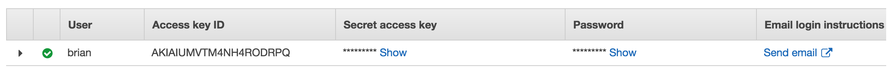
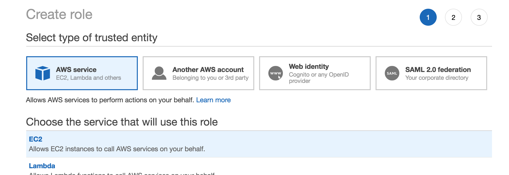
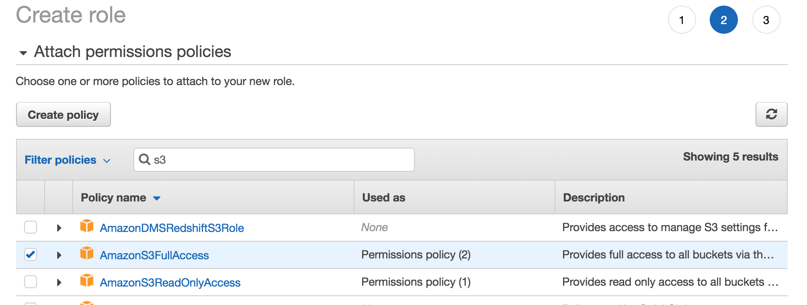
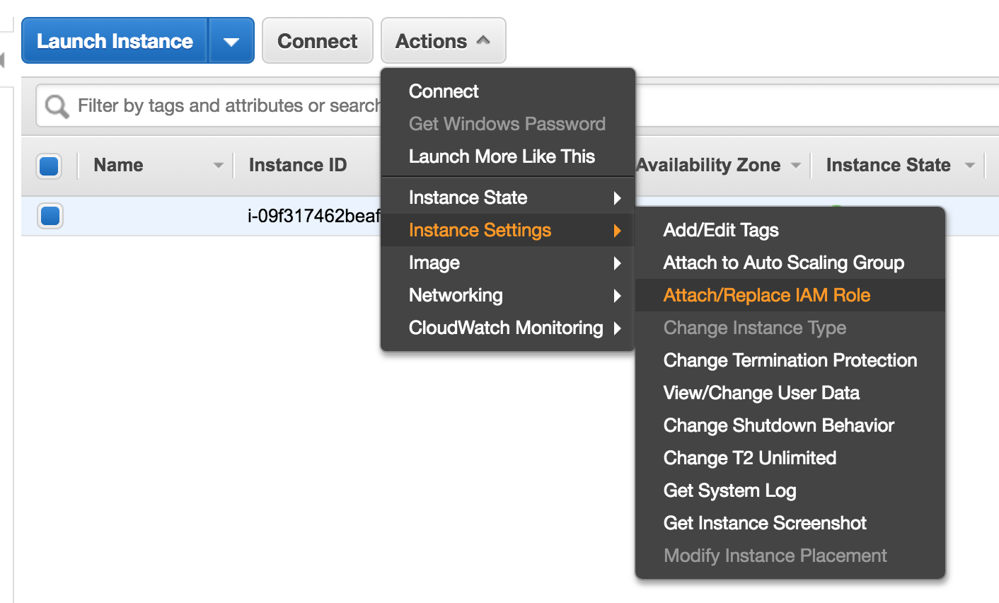

## IAM (Identity Access Management)

- Centralized control of AWS account
- Shared access to AWS account
- Granular permissions
- Identity Federation (including Active Directory, Facebook, Linkedin)
- Multi-factor authentication
- Provides temporary access for users/devices and services where necessary
- Allows for setup of password rotation policy
- Integrates with many different AWS services
- Supports PCI DSS compliance

Allows your to manage users and their level of access to the AWS Console.

IAM is universal/global. Does not apply to a region at this time.

The "root account" is the account created when first setup your AWS account. It has complete admin access.

New users have **NO** permissions when first created

New users are assigned **Access Key ID** and **Secret Access Keys** when first created.
  - These are not the same as a password, and cannot be used to login to the console. To be used with API, CLI, and SDK
  - Only view once, if lost you have to regenerate them.

Always setup multi-factor authentication on root account

#### Terms:

**_Users_**  
End users

**_Groups_**  
A collections of _users_ under one set of permissions

**_Roles_**  
Create roles and assign to AWS resources

**_Policies_**  
A document that defines one (or more) permissions. Can be assigned to users, groups, and/or roles.

Access Key ID and Secret Access Key are only used for programatic access (SDK, CLI), not the Console

#### Roles
- Roles are not region specific
- Roles are more secure than storing your access key and secret access key on individual EC2 instances
- Roles are easier to manage
- Roles can be assigned to and EC2 instance AFTER it has been provisioned using both the command line and AWS console
- Roles are universal - can be used in any region

Select the AWS service to attach to the role (EC2)

Can attach/ change IAM roles for EC2 instances
