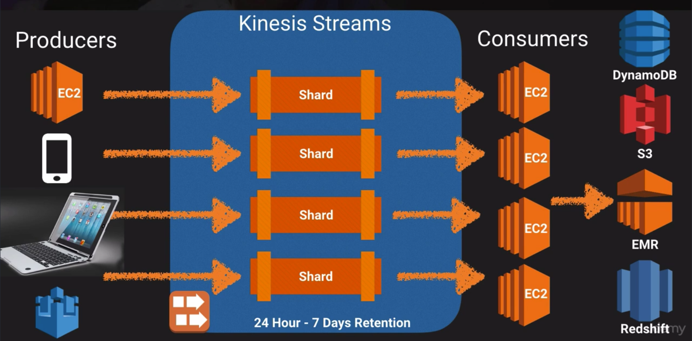
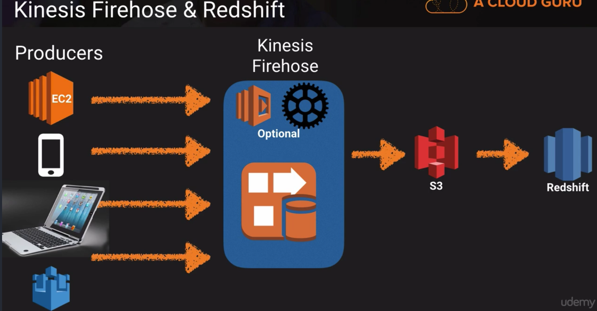
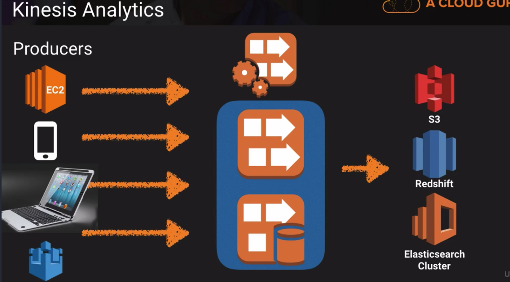

# Kinesis 101

- Enables streaming data to be transmitted

## Services
- Kinesis Streams
  - Producers (Applications, etc) send data to a stream
  - Streams are made up of _shards_
  - Default data retention: 24 hours
    - Up to 7 days
- Kinesis Firehose
- Kinesis Analytics

## Streaming Data
- Data generated continuously by thousands of data sources
- Typically sent simultaneously and in small sizes (KBs)
  - EX: Purchases from online stores
  - Stock Data
  - Game Data (as a gamer plays)
  - Social network data
  - Geospatial data (Lyft)
  - iOT sensor data

## Shards
- 5 transactions per second for reads
- Up to a maximum total data read rate of 2 MB per second 
- Up to 1,000 records per second for writes
- Up to a maximum total data write rate of 1 MB per second (including partial keys)
- Data capacity of a stream is based on the number of shards specified for a stream. 

## Kinesis Firehose
- Automated way to capture data received without concern for shards or consumers
- Does not contain shards
- Data is received, optionally processed, and sent to storage

## Kinesis Analytics
- Allows for SQL queries against data in Firehose

