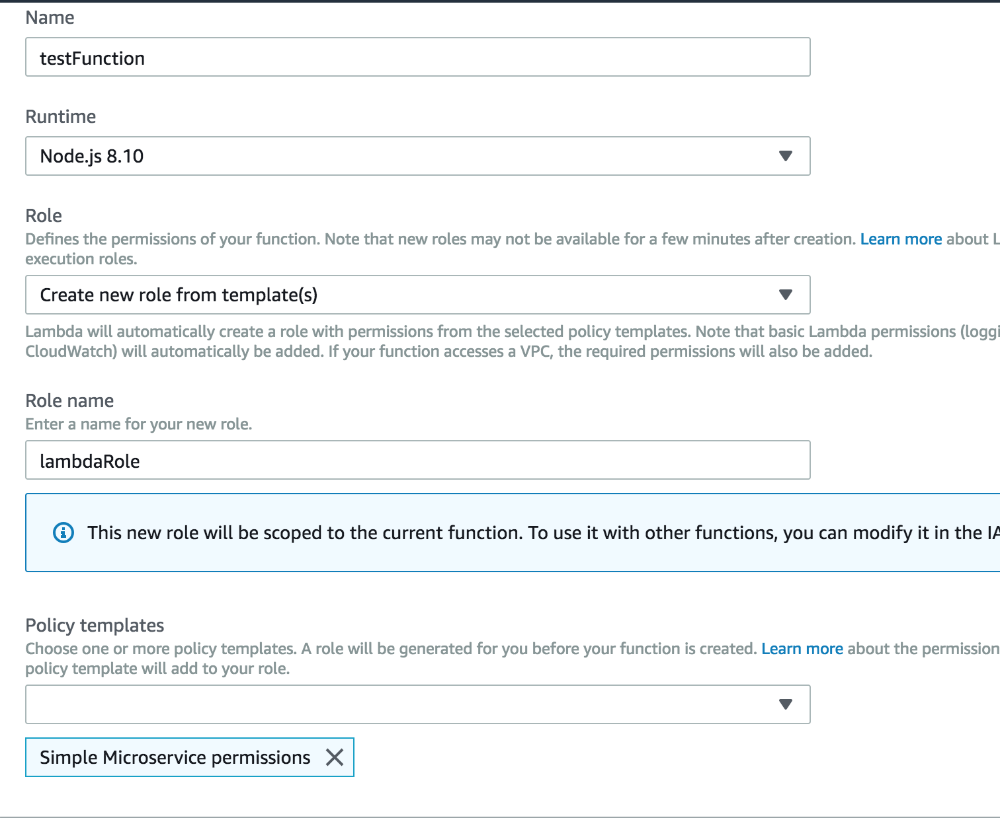

#### Lambda
Lambda is a compute service where you can upload your code and create a lambda function. Lambdas take care of provisions and managing the servers that you use to run the code. You don't have to worry about OS, patching, scaling, etc.

Uses:

- Event drive compute services where Lambda runs code in response to events. These events could be changes to data in an Amazon S3 bucket or DynamoDB table.
- Compute service is response to HTTP requests using Amazon API Gateway or API calls made using AWS SDKs.

Triggers:
- API Gateway
- AWS IoT
- Alexa Skills Kit
- Alexa Smart Home
- CloudFront
- CloudWatch Events
- CloudWatch Logs
- CodeCommit
- Cognito Sync Trigger
- DynamoDB
- Kinesis
- S3
- SNS

- One Lambda function per request, 1 event = 1 function
- Serverless
- Maximum execution time of 5 minutes
- Continuous scaling out (not up) automatically
- Lambda functions can trigger other lambda functions, 1 event can = x functions if functions trigger other functions
- Can do things globally, ex: backup s3 buckets to other s3 buckets

Runtimes available:
- C#
- Java
- Node
- Python

Pricing is based per request
First 1 million requests are free, $.20 per 1 million requests therafter
Prices are based on amount of ram and length of run
