### S3

**_Simple Storage Service (S3)_** - provides developers and IT teams with secure, durable, highly-scalable object storage. Allows for retrieval of any amount of data from anywhere on the web.

- Safe place to store files
- Object based, flat files
  - Key, Value Store
    - Key: Name
    - Value: Data, sequence of bytes
    - Version ID (Important for versioning)
    - Metadata (Data about data you are storing)
      - e.g. Date uploaded, Date last updated
    - Subresources
      - Access Control Lists
        - Fine-grained permissions  
      - Torrent
  - e.g. Videos, photos
  - NOT ment for a operating system, database, etc. that requires block storage
- Data is spread across multiple devices and facilities
- Built for 99.99% availability for the S3 platform
  - Amazon guarantees 99.9% availability
- Amazon guarantees 99.999999999% durability for S3 information (Remember 11 x 9's)
- Allows upload of files
- Files can be 0 Bytes to 5TB
- Unlimited storage
- Files are stored in buckets
- Tiered Storage available
- Lifecycle Management
  - After \___ days move data to \____
- Versioning
- Encryption
  - Client side encryption
  - Server side encryption
    - SSE iwht Amazon S3 Managed Keys (SSE-S3)
    - SSE with KMS (SS#-KMS)
    - SSE with customer provided keys (SSE-C)
- By default buckets are private and all objects stored inside them are private
- Secure data using Access Control Lists and Bucket Policies
- S3 is a universal namespace, that is, names must be unique globally
- Bucket URL: https://s3-us-east-1.amazonaws.com/mytestbucket
  - https://s3-[region].amazonaws.com/[bucketname]
- When uploading a file to S3 you will receive a HTTP 200 code if upload was successful
- Designed to be lexigraphical (sort objects in alphabetical order)
  - Filenames that are similar can create issues if created/ accessed frequently (i.e. log files)
  - Adding randomness to the beginning of the filename will allow files to be spread more evenly across S3
- Read S# FAQ!!!

#### Data Consistency Model

- Read after Write consistency for PUTS of new Objects
  - Can Read a file immediatly after adding
- Eventual Consistency for overwrite PUTS and DELETES (can take some time to propogate)
  - Could get new OR old version if reading after an update or delete

#### S3 - Storage Tiers/ Classes
- S3 - 99.99% availability, 99.999999999% durability, stored redundantly across multiple devices in multiple faciliies and is designed to sustain the loss of 2 facilities concurently
- S3 - IA (Infrequently Accessed) For data that is accessed less frequently, but requires rapid access when needed. Lower fee that S3, but you are charged a retrieval fee.
  - HR data that might be reviewed quarterly or annually that can't wait for retrieval from Glacier
- Reduced Redundancy Storage (RRS) - Designed to provide 99.99% durability and 99.99% availability of objects over a given year.
  - Data that can be generated again, e.g. Storing images in an S3 bucket and thumbnails in an RRS bucket
- Glacier - is extremely low-cost storage service for data archival. Amazon Glacier stores data for as little as $0.01 per gigabyte per month, and is optimized for data that is infrequently accessed and for which retrieval times of 3 to 5 hours are suitable. 

||||||
|---|---|---|---|---|
||Standard|Standard - Infrequent Access|Reduced Redundancy Storage|Glacier|
|Durability|99.999999999%|99.999999999%|99.99%|99.999999999%|
|Availability|99.99%|99.9%|99.99%|N/A|
|Availability SLA|99.9%|99%||N/A|
|Concurrent facility fault tolerance|2|2|1|2|
|SSL Support|Yes|Yes|Yes|
|Retrieval Fee|N/A|per GB retrieved||per GB retrieved|
|First byte latency|Milliseconds|Milliseconds|Milliseconds|select minutes or hours|
|Storage Class|object level|object level|object level|object level|
|Lifecycle Management Policies|Yes|Yes|Yes|Yes|

#### Charges
- Storage
- Requests
- Storage Management Pricing
  - Tagging of data to help manage data source, etc. (HR vs. Business Data)
  - Pricing on a per tag basis
- Data Transfer Pricing
  - Data coming into S3 is free
  - Data moving around S3 (e.g. replication) is charged
- Transfer Accelaration
  - Enables fast, easy, and secure transfer of files over long distances between end user and S3 bucket. Transfer Accelaration takes advantage of CloudFront's globally distributed edge locations. As the data arrives at an edge location, data is routed to S3 over optimized network path.

#### Uploading to S3
- Objects do not inherit buckets tag(s)
- Minumum file size is 0 bytes

#### Versioning
- Once enable, cannot be disabled only suspended
- Multi-factor authentication delete can be enabled to prevent or cause thought when deleting a file, version of file under versioning. Provides and additional layer of security.
- Stores all version of an object (including all writes and even if you delete an object)
- Great backup tool
- Integrates with Lifecycle rules

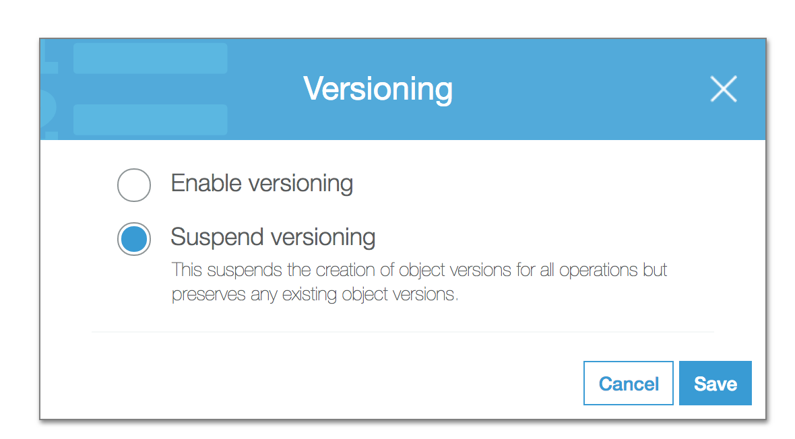
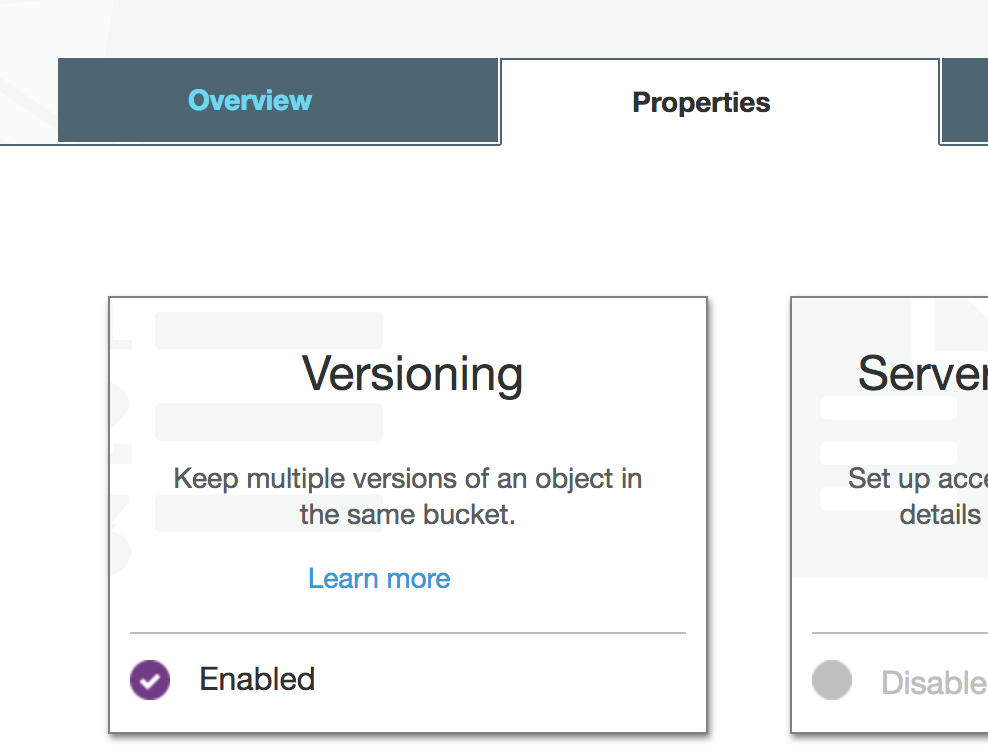
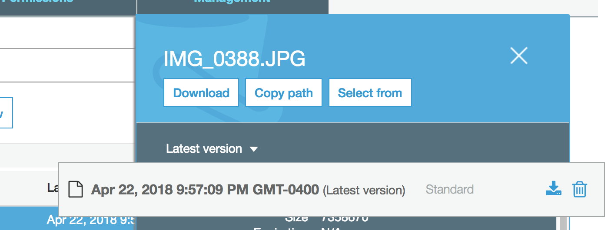
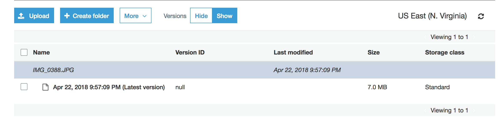

#### Cross Region Replication
- Versioning must be enabled on both source and destination buckets
- Regions must be unique
- Files in an existing bucket are not replicated automatically. All subsequent uploaded files will be replicated automatically.
- You cannot replicate to multiple buckets or use daisy chaining (at this time).
- Delete markers are replicated.
- Deleting individual versions or delete markers will not be replicated

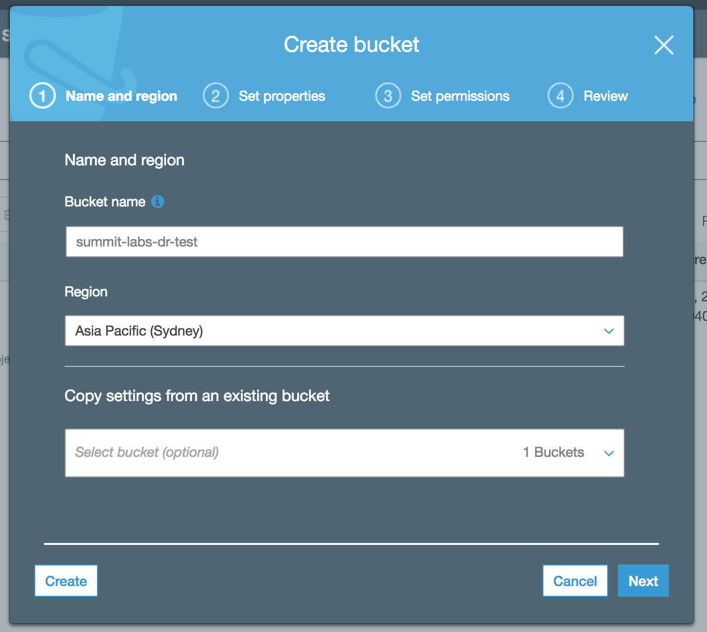
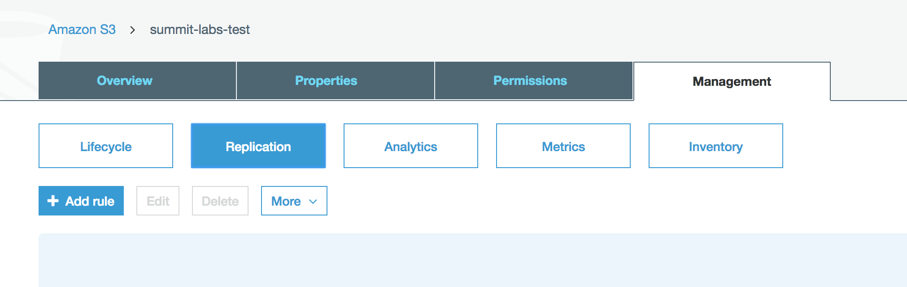
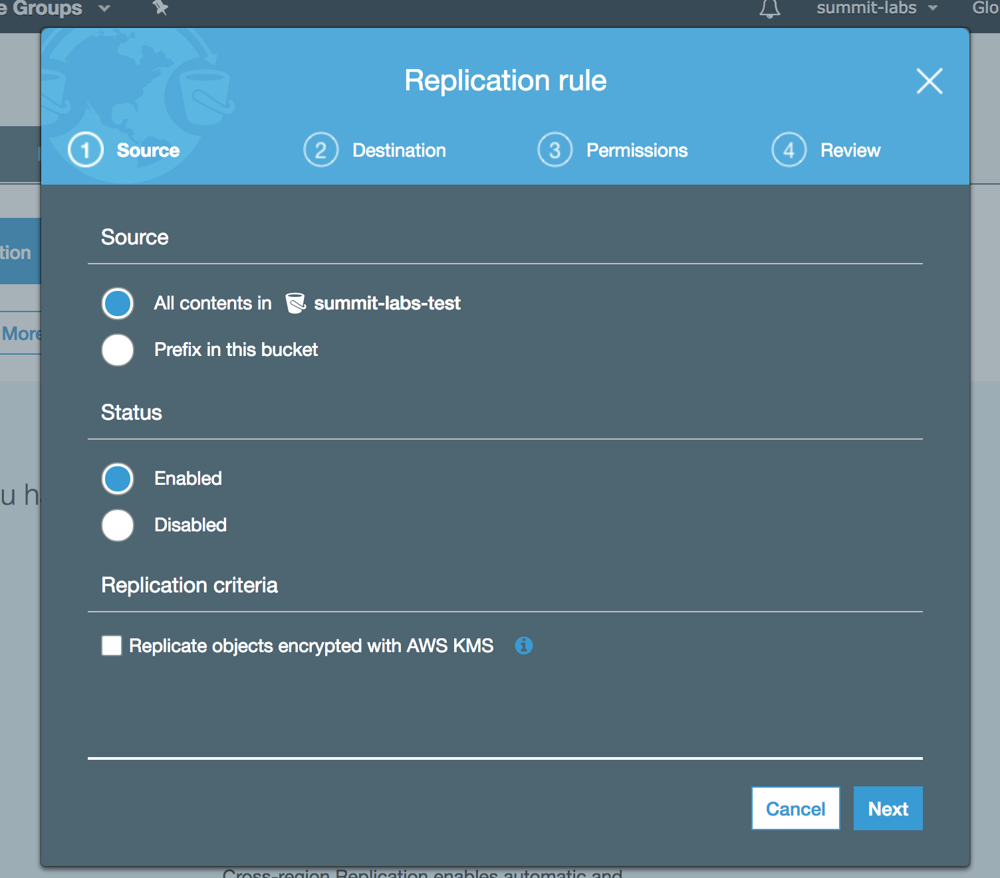
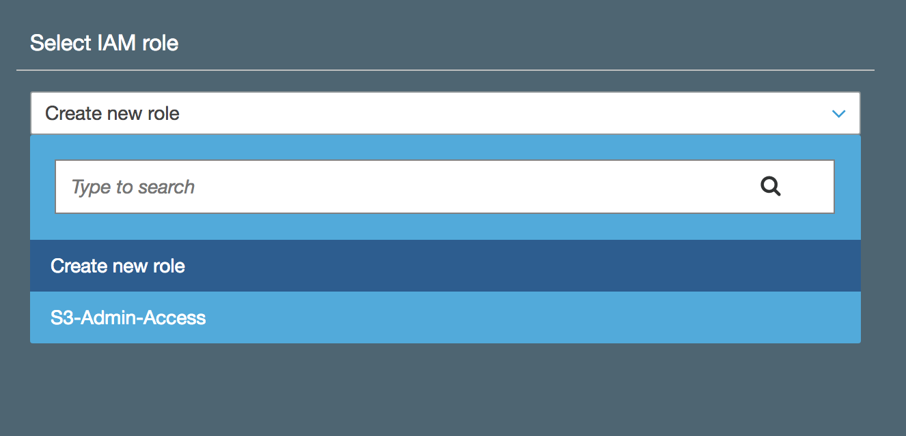

#### Lifecycle Management, S3-IA & Glacier
- Can be used in conjunction with versioning
- Can be applied to current and previous versions
- Following actions can be done:
  - Transition to Standard-IA storage class (128kb and 30 days after the creation date)
  - Archive to Galcier Storage Class (30 days after IAm if relevant)
  - Permanently Delete
- Used to help minimize storage costs

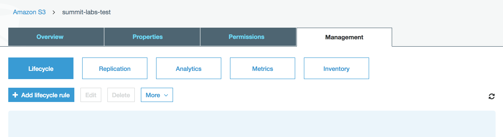
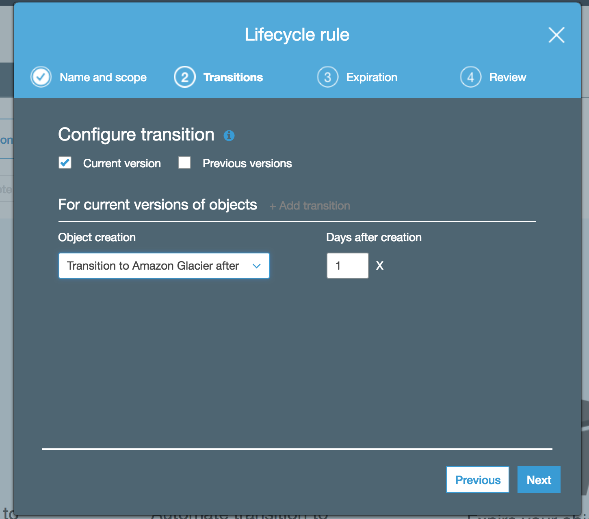

#### Security and Encryption
_Security_
- By Default, all newly created buckets are PRIVATE
- Access can be controlled through:
  - Bucket Policies
  - Access Control Lists (ACL)
- S3 buckets can be configured to create access logs which log all requests made to the S3 bucket. This can be done to another account.

_Encryption_  

Is possible:
- In transit;
  - SSL/TLS

- At Rest
  - Server Side Encryption
    - S3 Managed Keys - SSE-s3
    - AWS Key Management Service, Managed Keys - SSE-KMS
      - Allows for auditing of key usage
    - Server Side Encryption with Customer Provided Keys - SSE-C
  - Client Side Encryption

#### S3 Transfer Acceleration

Utilizes the CloudFront Edge Network to accelerate uploads to S3. Instead of uploading directly to an S3 bucket, you can use a distinct URL to upload directly to an edge location which will then transfer that file to S3. A distinct URL might look like: _mysuperbucket.s3-accelerate.amazonaws.com_

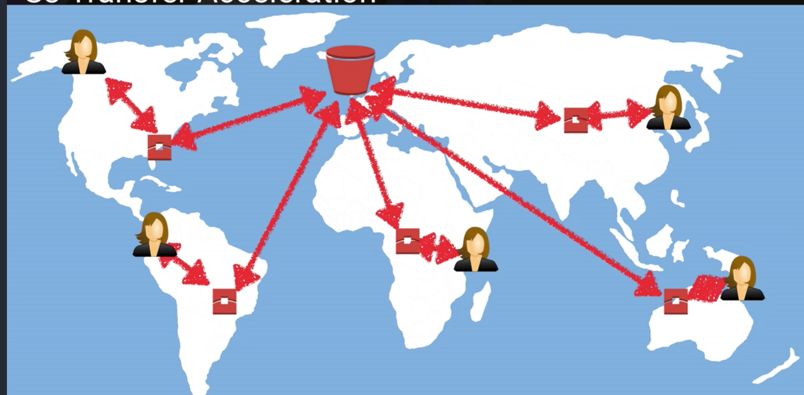

#### Static Website Hosting

Can be used to host a static website on S3 for very low-cost. Cannot host dynamic content.

Endpoint URL:  
_http://\<S3 bucket name>.s3-website-\<region>.amazonaws.com_  
http://mysite.s3-website-us-east-1.amazonaws.com