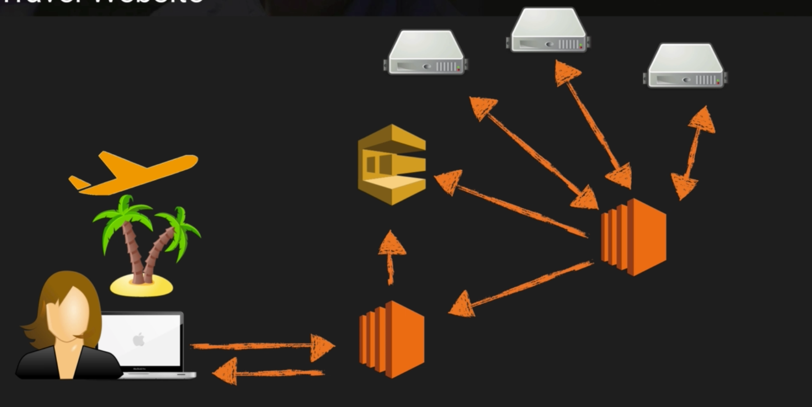

# Simple Queue Service SQS

A web service that gives access to a message queue that can be used to store messages while waiting for a computer to process them.

A distributed queue system that enables web service applications to quickly and reliably queue messages that one component in the application generates to be consumed by another component. A queue is a temporary repository for messages that are awaiting processing.

Allows for decoupling of components that run independently, easing message management between components.

Any component of a distributed application can store messages in the queue. Messages can contain up to 256 KB of text in any format. Any component can later retrieve the messages programmatically using the SQS API.

Acts as a buffer between the component producing and saving data, and the component receiving the data for processing. The queue resolves issues that arise if the producer is producing work faster than the consumer can process. Or if the producer or consumer are only intermittently connected to the network.

## Queue Types
- Standard Queues
  - Default queue type
  - Nearly-unlimited number of transactions per second
  - Guaranteed delivery of messages at least once
    - More than one copy of a message might be delivered out of order
  - Makes best effort to deliver in order
- FIFO (first-in-first-out)
  - Ordered delivery, strictly preserved
  - Exactly-once processing
  - No duplicates
  - Messages are preserved until a consumer processes and deletes
  - Allow for message groups that allow for multiple ordered message groups within a single queue
  - Limited to 300 transactions per second (TPS)
  - Have all of the capabilities of Standard Queues

### Visibility Timeout
- Amount of time that the message is invisible in SQS after a reader picks up the message
  - If the job is processed before the timeout it will be deleted from queue
  - If not the message will become visible and another reader can begin processing
- Default timeout is 30 seconds
- Increase if task takes >30 seconds
- Max 12 hours

### Long Polling
- Way to retrieve messages from SQS queues
- Doesn't return a response until a message arrives in the queue, or the long poll times out
- Can save money

### Short Polling
- Returns immediately, even if empty

- Pull based system (polling), not pushed-based
- Messages are saved in the queue until processed, i.e. if an app server crashes the message will persist
- Messages can be kept in the queue from 1 minute to 14 days
  - Default retention is 4 days
- Guaranteed processing at least once
- Autoscaling can evaluate the queue and provision new instances appropriately 

