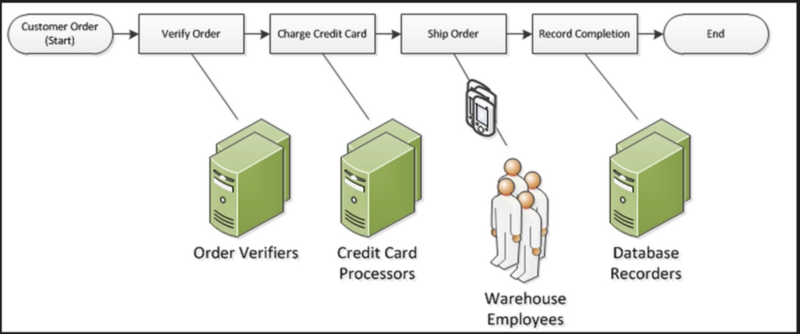

# Simple Workflow Service
- Web service for coordinating work across distributed application components
- Example use cases:
  - Media processing
  - Web app backends
  - Business process workflows
  - Analytics pipelines
- Brokers interaction between workers and deciders
- Ensures tasks are assigned only **once**
- Manages application state
  - Workers and deciders do not track execution state
- Max workflow is 1 year
  - Value is measured in seconds

## Tasks
- Represent invocations of various processing steps in an application which can be performed by: code, web service calls, human actions, and scripts.
- Stored and assigned to workers when ready
- Monitored while in progress

### Workflow Starters
- An application that can initiate a workflow. i.e. ecommerce website when placing and order or a mobile app searching for bus times

### Workers
- Programs that interact with SWF to get tasks, process tasks, and return results.
- Can run independently and scale

### Decider
- Program that controls the coordination of tasks, i.e. their ordering, concurrency, and scheduling according to the application logic
- Can get consistent view of progress of tasks and initiate new tasks in an ongoing manner
- Can run independently and scale
- Controls the flow of activity tasks in a workflow execution.
  - If a task finishes or fails in a workflow it decides what to do next

### Domain
- Isolate a set of types, executions, and task lists from others within the same account
- Can be registered via console or _RegisterDomain_ action in API
|SWF|SQS|
|:---|:---|
|Task oriented API|Message oriented API|
|Ensures task is only assigned once and never duplicated|Application is responsible for handling tasks and ensuring messages aren't processed multiple times|
|Tracks all of the tasks and events in an application|Requires application level tracking, especially if application uses multiple queues|

