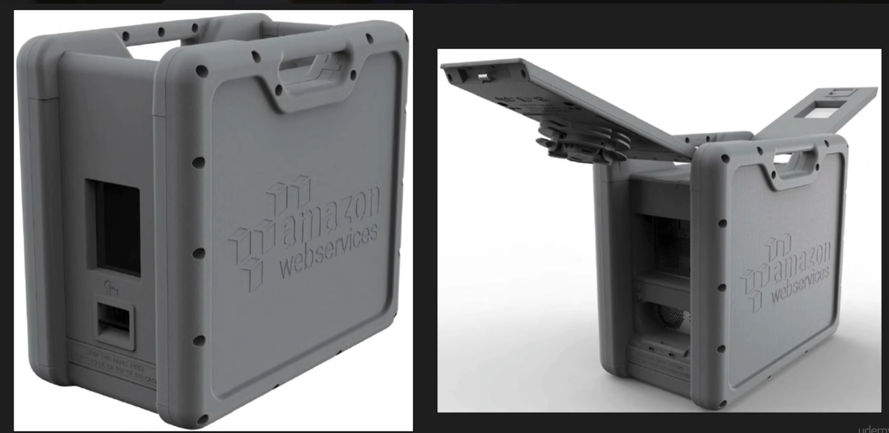
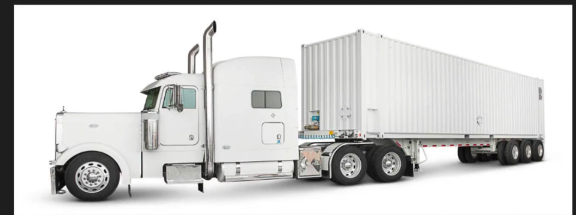

### Snowball  

AWS Import/Export Disk accelerates moving large amounts of data into and out of the AWS cloud using portable storage devices for transport. AWS Import/Export Disk transfers your data directly onto and off of storage devices using Amazon's high-speed internal network and bypassing the Internet.

Prior to being called _Snowball_, import/export was a service that would receive storage devices of all shapes and sizes from customers wanting to transfer data. This became a management nightmare, leading to the creation of _Snowball_.

- Import to S3
- Export from S3
  - From Glacier will require a restoration to S3 prior to exporting

#### Types of Snowballs

**_Snowball_**  
Petabyte-scale data transport solution that uses secure appliances to transfer large amounts of data into and out of AWS. Using Snowball addresses common challenges with large-scale data transfers including high-network costs, long transfer times, and security concerns. Transferring data with Snowball is simple, fast, secure, and can be as little as 1/5 the cost of high speed internet.

80TB snowball in all regions. Snowball uses multiple layers of security designed to protect your dat including tamper-resistent enclosures, 256-bit encryption, and an industry-standard Trusted Platform Module (TPM) designed to ensure both security and full chain-of-custody of your data. Once the data transfer job has bee processed and verified, AWS performs a software erasure of the Snowball appliance.

**_Snowball Edge_**  
Similar to _Snowball_. Includes 100TB data transfer device with _on-board storage and compute capabilities_. You can use Snowball Edge to move large amounts of data into and out of AWS, as a temporary storage tier for large local datasets, or to support local workloads in remote or offline locations.

Snowball Edge connects to your existing appliances and infrastructure using standard storage interfaces, streamlining the data transfer process and minimizing setup and integration. Snowball Edge can cluster together to form a local storage tier and process your data on-premises, helping ensure your applications continue to run even when they are not able to access the cloud.

Ex: Airplane manufacturer can install Snowball Edge on airplane to collect flight data, then send device back for analysis.

**_Snowmobile_**  
AWS Snowmobile is an Exabyte-scale data transfer services used to move extremely large amounts of data to AWS. You can transfer up to 100PB per Snowmobile, a 45-foot long ruggedized shipping container, pulled by a semi-trailer truck. Snowmobile makes it easy to move massive volumes of data to the cloud, including video libraries, image repositories, or even a complete data center migration. Transferring data with Snowmobile is secure, fast, and cost-effective.

