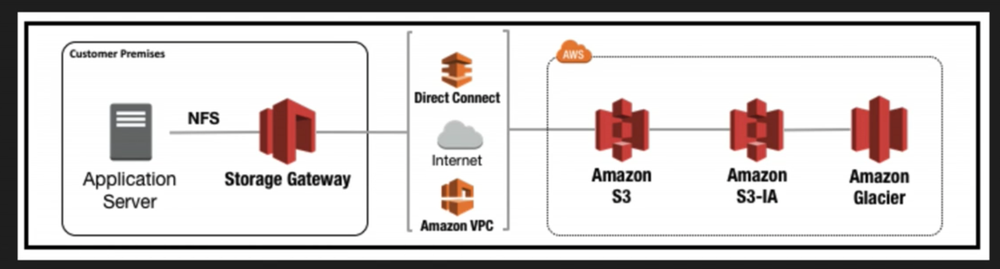
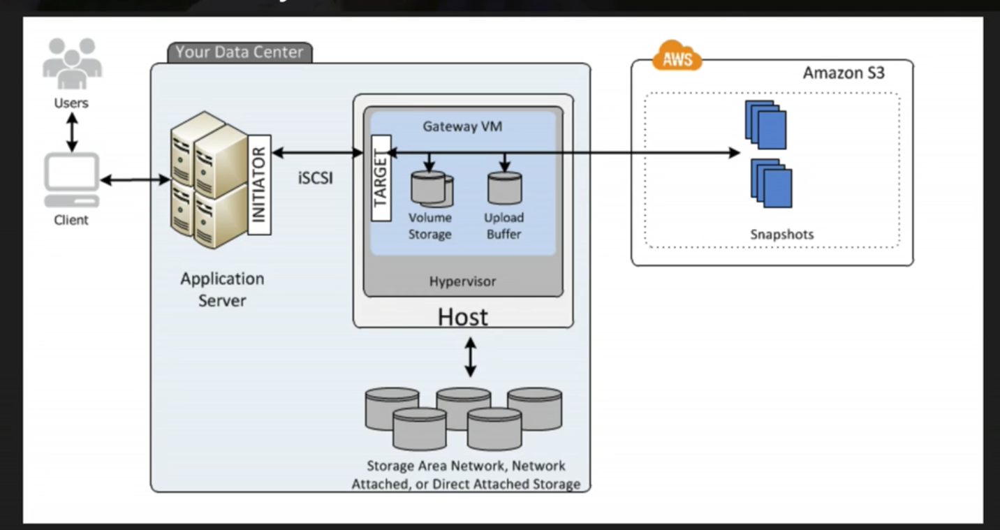
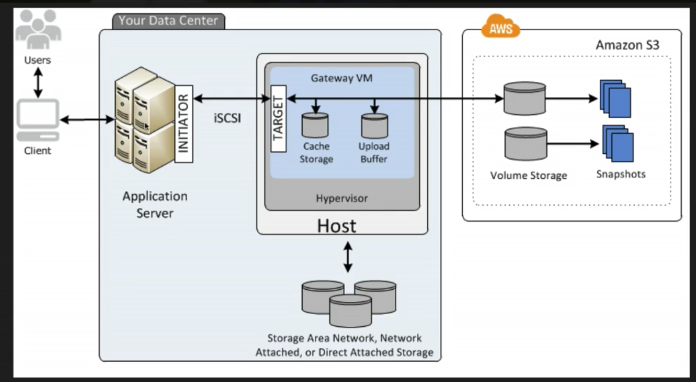
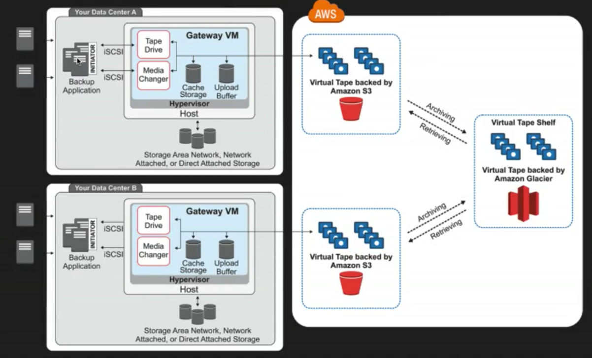

### Storage Gateway  

AWS Storage Gateway is a service that connects an on-premises software application with cloud-based storage to provide seamless and secure integration between an organizations on-premises IT environment and AWS's storage infrastructure. The service enables you to securely store data to the AWS cloud for scalable and cost-effective storage.

AWS Storage Gateway's software appliance is available for download as a virtual machine (VM) image that you install on a host in your datacenter. Storage Gateway supports either VMware ESXi or Microsoft Hyper-V. Once gateway is installed and associated with your AWS account through the actication process, you can use the AWS Management Console to create the storage gateway option that is right for you.

#### Storage Gateway Types

**_File Gateway (NFS)_**  
Flat file storage in S3 (photos, documents, etc). Files are stored as objects in S3 buckets, accessed through a Network File System (NFS) mount point. Ownership, permissions, and timestamps are durably stored in S3 in the user-metadata of the object associated with the file. Once objects are transfered to S3, they can be managed as natice S3 objects, and bucket policies such as versioning, lifecycle management, and cross-region replication apply directly to objects stored in the bucket.

**_Volumes Gateway (iSCSI)_**  
Block based storage, virtual hard disk, capable of storing/operting a n operating system. Ex: MySQL server. The volume interface presents your applications with disk volumes using the iSCSI block protocol.

Data written to these volumes cn be asyncronously backed up as point-in-time snapshots of your volumes, and stored in the cloud as Amazon Elastic Block Store (EBS) snapshots.

Snapshots are incremental backups that capture only changed blocks. All snapshot storage is also compressed to minimize storage charges. 

  - **_Stored Volumes_**  
  A stored copy of the entire dataset on-premises, while asyncronously backing up that data to AWS. Sotred volumes provide your on-premises applications with low-latency acccess to their entire datasets, while providing durable, off-site-bakcups. You can create storage volumes and mount them as iSCSI devices from you on-premises application servers. Data written to your stored volumes is stored on your on=premises storage hardware. This data is asynchronously backed up to AWS S3 in the form of AWS EBS snapshots. 1GB - 16TB in size for Stored Volumes.

  - **_Cached Volumes_**  
 Only storing the most recently accessed data is stored on-premises, remained data is backed up onto AWS. Allow S3 to be your primary data storage while retrining frequently accessed data locally in your storage gateway. Chacehd volumes minimized the need to scale your on-premises storage infrastructure, while still providing your applications with low-latency access to their frequently acccessed data. You can create storage volumes up to 32TB in size and attach to them as iSCSI devices from your on-premises application servers. Your gateway stores data that you write to those volumes in S3 and retains recently read data in your on-premises storage gateway's cache and upload buffer storage. 1GB - 32TB in size for Cached Volumes.

Previous Name(s): Gateway stored volumes, Gateway cached volumes

**_Tape Gateway (VTL)_**  
Backup, archiving solution, allowing you to create virtual tapes and send them to S3. Offers a durable, cost-effectice solution to archive data in the AWS cloud. The VTL interface it provides lets you leverage your existing tape-based backup application infrastructure to store dta on virtual tape cartridges that you create on your tape gateway. Each tape gateway is preconfigured with a media changer and tape drives, which are available to your existing client backup applications as iSCSI devices. You add tape cartridges as you need to archive your data. Supported by NetBackup, Backup Exec, Veeam, etc.

Previous Name: Gateway virual tape library

