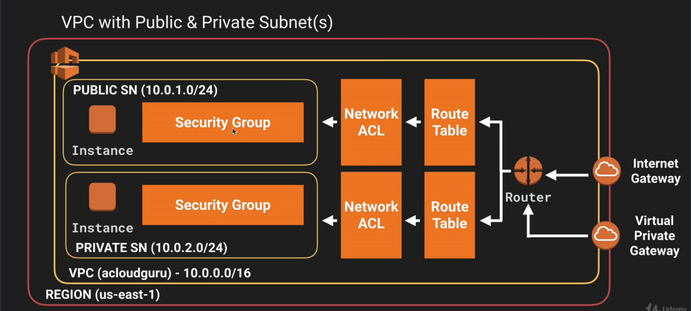

## Virtual Private Clouds (VPC)
"Like a virtual data centre in the cloud"
- Provision a logically isolated section of AWS for launching AWS resources in a virtual network
  - Allows for selection of:
    - IP address range
    - Subnets
    - Route tables and network gateways
- Internet gateway, only 1 per VPC
- Security groups are stateful, Network Access Control Lists (NACL) are stateless

### Subnets
- 1 subnet = 1 AZ
- Setting up a new Subnet will 'loose' 5 addresses based on the default/reserved subnets

### VPC Peering
- Allows for connection between VPCs via a direct network route using private IP addresses
- Instances behave as if they were on the same private network
- Can peer VPC's with other AWS accounts or within same AWS account
- Star configuration (a.k.a. Hub and spoke). 1 central VPC with 4 others peering. *No Transitive Peering*

### Internet Gateway
- Can only be attached to one VPC
- Defaults to _detached_ when first created

### NAT Instances & NAT Gateways
- NAT Instances
    - Disable Source/Destination check on the instance
    - Are being deprecated
    - Must be in a public subnet
    - Must be a route out of the private subnet to the NAT instance
    - The amount of traffic that NAT Instances can support depends on instance size. If bottlenecked increase instance size.
    - Single instance dependency
        - Can create HA using autoscaling groups, multiple subnets in different AZs and a script to automate failover
    - Behind a Security Group
- NAT Gateway (Preferred)
    - High availability
    - Needs to be created in each AZ
        - Must update route tables
    - Scale automatically to 10Gbps
    - No need to patch
    - Need to update Route Tables when provisioning
    - Not associated with security groups
    - Automatically assigned a public IP address
    - No need to disable source/destination checks
    - More secure than a NAT Instance

## Network Access Control Lists (NACL) vs Security Groups

### NACL
- A subnet can only be associated to *ONE* NACL
- Each subnet in the VPC must be associated with a NACL. If you don't explicitly associate a subnet with a NACL the subnet is automatically associated with the default NACL
- A VPC automatically comes with a default NACL, and by default it allows all inboud/outbound traffic
- NACL can be associated with multible subnets; however, a subnet can be associated with only one NACL at a time. When associating a NACL with a subnet, the previous association is removed.
- Can only be associated with *ONE* VPC
- By default for custom NACL all inbound/outbond access is denied, rules must be applied to allow access
- Ephemeral Ports should be allowed on outbound rules
- Rules are evaluated in numerical order starting with the lowest numbered rule
- NACLs have seperate inbound/outboud rules, each rule can either allow or deny traffic
- NACLs are stateless; responses to allow inbound traffic are subject to the rules for outbound traffic (and vice versa).
- Assessed before Security Groups
- Block IP addresses using NACLs _not_ Security Groups
- VPC automatically comes with a default NACL, by defulat it allows all inbound/outbound traffic

### Security Groups
- Don't span VPCs, must create a new SG for a VPC

### VPC Flow Logs
- Enables capturing of information about the IP traffic going to and from network interfaces in VPC
- Stored in Amazon CloudWatch logs
- Can be viewd and retrieved through CloudWatch
- Can be created at:
    - VPC
    - Subnet
    - Network Interface Level
- Can not enable flow logs for VPCs that are peered with your VPC unless the peer VPC is in your account
- Can not tag a flow log
- After created, cannot change a flow log configuration; i.e. cannot change IAM role with flow log
- Not all IP traffic is monitored:
    - Traffic generated by instances when you contact the Amazon DNS server. If you use your own DNS server then all traffic to that DNS server is logged.
    - Traffic generated by a Windows instance for Amazon Windows license activation
    - Traffic to and from 169.254.169.254 for instance metadata
    - DHCP Traffic
    - Traffic to the reserved IP address for the default VPC router

## NATS vs Bastion

### NAT Instance
- Always behind security group
- Provides internet traffic to EC2 in private subnets (installing MySQL, etc.)

### Bastion
- Used for administering servers (using SSH or RDP) inside the private subnets
- AKA Jump box
- HA is possible through multiple subnets (1 subnet = 1 AZ)

### VPC Endpoint
- Elastic network Interface (ENI)

Ex: VPC Gateway

Final VPC layout:
